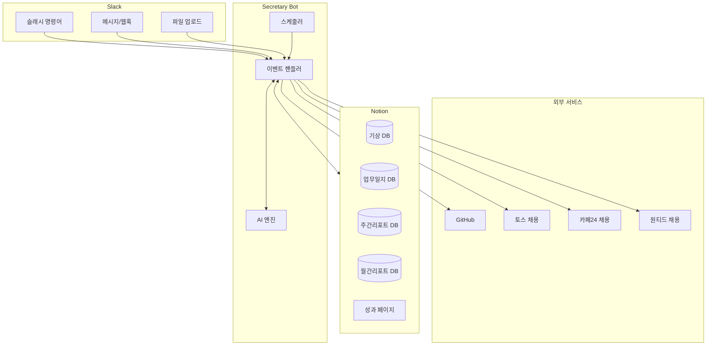
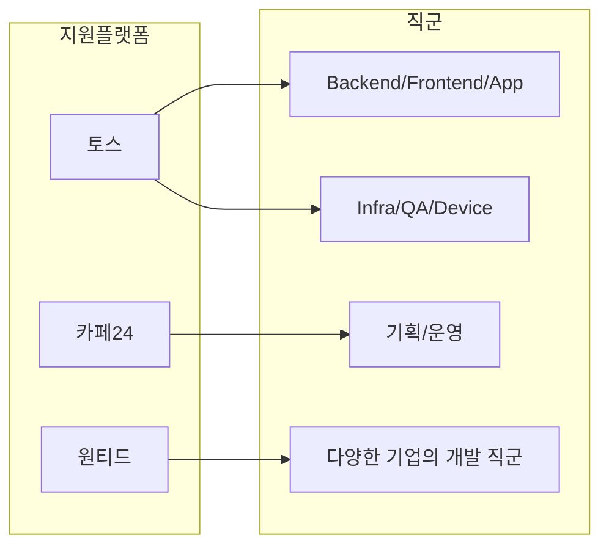
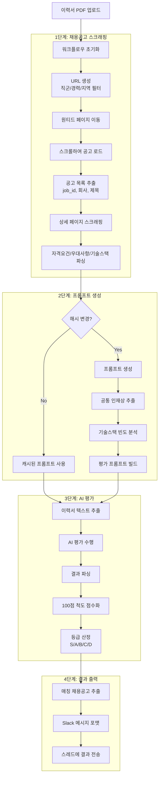
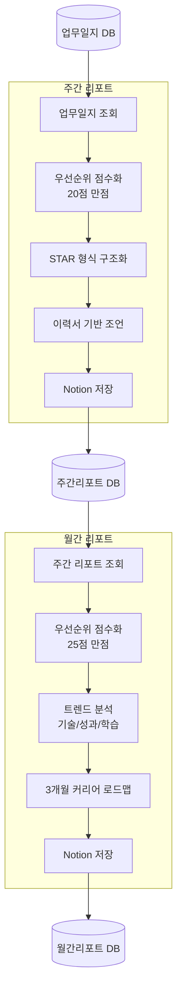
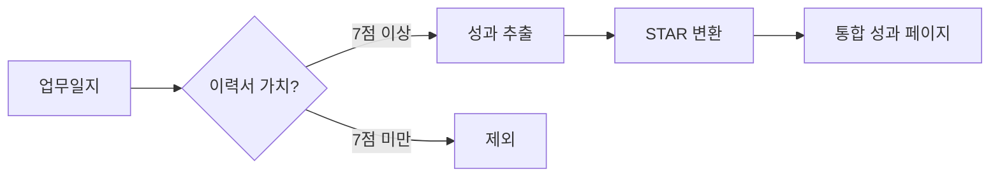

# 김비서 (Kim Secretary)

> Notion + Slack + AI 기반 개인 비서 봇

## 아키텍처



## 기능 요약

| 기능 | 설명 | 트리거 |
|------|------|--------|
| 기상 관리 | 기상 시간 기록 및 통계 | 자동 (6:30 AM) |
| 업무일지 피드백 | AI 기반 업무일지 피드백 | `/업무일지피드백` |
| 주간 리포트 | STAR 형식 주간 성과 분석 | `/주간리포트`, 자동 (금 22:00) |
| 월간 리포트 | 트렌드 분석 + 커리어 로드맵 | `/월간리포트`, 자동 (매월 1일) |
| 성과 분석 | 이력서용 성과 추출 + STAR 변환 | `/성과분석` |
| 이력서 평가 | 채용공고 기반 이력서 평가 | PDF 업로드 |
| 업무일지 발행 | Notion → GitHub 블로그 자동 발행 | Notion 체크박스 |

---

## 이력서 평가 시스템

### 지원 플랫폼



### 원티드 스크래핑 플로우



### 평가 기준 (100점 만점)

| 영역 | 배점 | 세부 항목 |
|------|------|----------|
| 핵심 기술 역량 | 40점 | 기술적 전문성 (20) + 프로젝트 경험 (20) |
| 문제 해결 능력 | 25점 | 기술적 문제 해결 (15) + 성능 최적화 (10) |
| 소프트 스킬 | 20점 | 협업/커뮤니케이션 (10) + 성장 마인드셋 (10) |
| 포지션 적합성 | 15점 | 직무 관련성 (10) + 경력 수준 (5) |

### 사용 방법

```python
from src.resume_evaluator import (
    WantedEvaluationWorkflow,
    WantedWorkflowConfig,
    WantedJobCategory,
)

# 워크플로우 설정
config = WantedWorkflowConfig(
    ai_provider="claude",
    max_jobs=10,
    years_min=0,
    years_max=3,
)

workflow = WantedEvaluationWorkflow(config)

# 직군별 평가
await workflow.initialize(categories=[WantedJobCategory.BACKEND])
result = await workflow.evaluate_resume_file("resume.pdf")

# 특정 기업 기준 평가
result = await workflow.evaluate_for_company("resume.pdf", "클래스101")
```

---

## 리포트 생성 플로우



---

## 성과 분석 플로우



**추출 기준**
- 비즈니스 임팩트 (매출, 사용자 수, 전환율)
- 기술적 난이도 (새 기술, 아키텍처 설계)
- 문제 해결 (버그 수정, 장애 대응)
- 협업/리더십 (멘토링, 기술 문서화)

---

## 슬래시 명령어

| 명령어 | 설명 |
|--------|------|
| `/상태` | 봇 상태 확인 |
| `/기상테스트` | 기상 메시지 테스트 |
| `/업무일지피드백` | 업무일지 AI 피드백 |
| `/주간리포트` | 주간 리포트 생성 |
| `/월간리포트` | 월간 리포트 생성 |
| `/성과분석` | 성과 추출 및 STAR 변환 |

---

## 설치 및 실행

### 환경 변수

```bash
# Slack
SLACK_BOT_TOKEN=xoxb-...
SLACK_APP_TOKEN=xapp-...
SLACK_RESUME_FEEDBACK_CHANNEL_ID=...

# Notion
NOTION_API_KEY=...
NOTION_USER_DATABASE_MAPPING='{"USER_ID":{"alias":"홍길동","work_log_db":"...","weekly_report_db":"...","monthly_report_db":"...","resume_page":"...","achievements_page":"..."}}'

# AI (Gemini CLI 방식 - API_KEY 불필요)
GEMINI_MODEL=gemini-2.5-pro
GEMINI_TIMEOUT=5000

# Claude Code (CLI 방식)
CLAUDE_CODE_ENABLED=true
CLAUDE_CODE_TIMEOUT=300

# GitHub (업무일지 발행용)
GITHUB_TOKEN=ghp_...
GITHUB_REPO_URL=https://github.com/...
```

### 로컬 실행

```bash
python -m venv .venv
source .venv/bin/activate
pip install -r requirements.txt
python app.py
```

### Docker 실행

```bash
docker buildx build --platform linux/amd64,linux/arm64 -t kim-secretary:latest --push .
```

---

## 프로젝트 구조

```
secretary/
├── app.py                          # 메인 엔트리포인트
├── src/
│   ├── ai/                         # AI 제공자 (Gemini, Claude, Ollama)
│   ├── analyzers/                  # 주간/월간 분석, 성과 추출
│   ├── commands/                   # 슬래시 커맨드 핸들러
│   ├── github/                     # GitHub 연동 (블로그 발행)
│   ├── notion/                     # Notion API 클라이언트
│   ├── resume_evaluator/           # 이력서 평가 모듈
│   │   ├── models.py               # 데이터 모델 (Enum, Dataclass)
│   │   ├── scraper.py              # 토스 스크래퍼
│   │   ├── scraper_cafe24.py       # 카페24 스크래퍼
│   │   ├── scraper_wanted.py       # 원티드 스크래퍼
│   │   ├── prompt_generator.py     # 토스 프롬프트 생성기
│   │   ├── prompt_generator_cafe24.py
│   │   ├── prompt_generator_wanted.py
│   │   ├── evaluator.py            # AI 평가 실행기
│   │   ├── job_classifier.py       # 직군 분류기
│   │   ├── workflow.py             # 토스 워크플로우
│   │   ├── workflow_cafe24.py      # 카페24 워크플로우
│   │   ├── workflow_wanted.py      # 원티드 워크플로우
│   │   └── cli.py                  # CLI 인터페이스
│   ├── schedule/                   # 스케줄러 (APScheduler)
│   └── prompts/                    # AI 프롬프트 템플릿
├── scripts/                        # 유틸리티 스크립트
│   ├── test_wanted_scraper.py      # 원티드 스크래퍼 테스트
│   ├── batch_generate_weekly_reports.py
│   └── batch_generate_monthly_reports.py
└── docs/                           # 상세 문서
    └── PUBLISH_WORK_LOG_SETUP.md   # 업무일지 발행 설정
```

---

## AI 프롬프트 엔지니어링

| 기법 | 설명 |
|------|------|
| Chain of Thought | 5단계 분석 프로세스 |
| Priority Scoring | 정량적 우선순위 점수화 |
| Few-shot Learning | 좋은 예시/나쁜 예시 제공 |
| Resume Gap Analysis | 이력서 개선 포인트 도출 |
| Meta-cognition | 출력 전 품질 검증 |

---

## 테스트

```bash
# 원티드 스크래퍼 테스트
python scripts/test_wanted_scraper.py --scrape --max-jobs 5

# 이력서 평가 테스트
python scripts/test_resume_eval.py

# 성과 분석 테스트
python scripts/test_achievement_analysis.py
```

---

## 라이선스

MIT License
